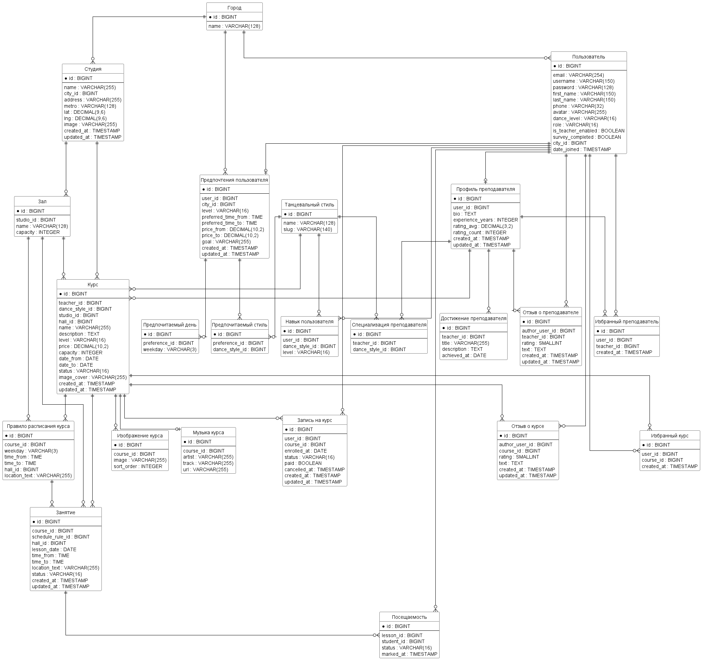
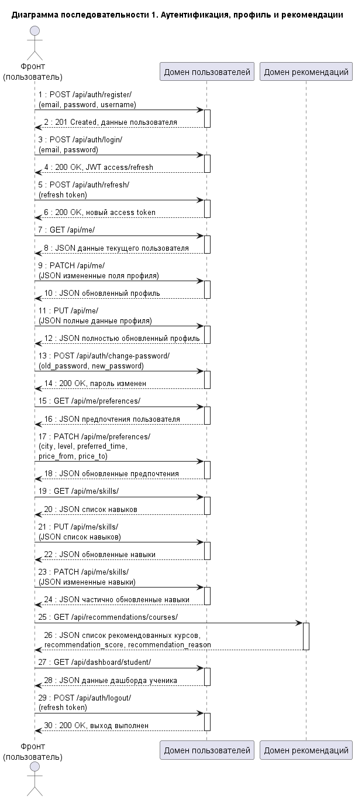
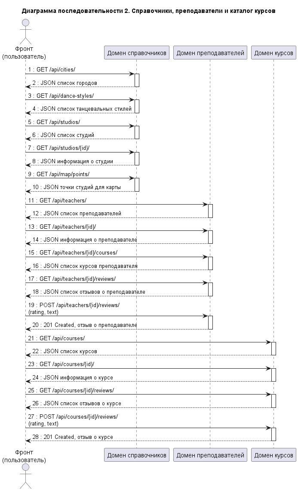
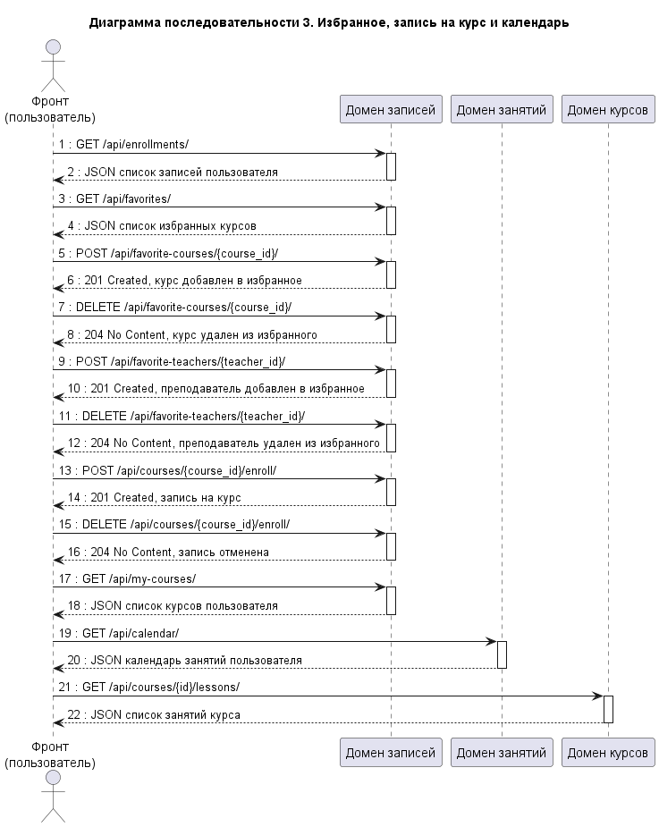
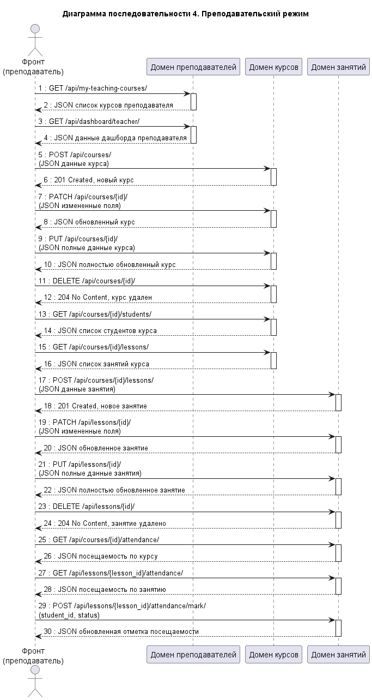

# DanceHub Backend

Backend-часть дипломного проекта для сервиса поиска, подбора и записи на танцевальные курсы. Проект реализован на `Django` и `Django REST Framework`, использует `PostgreSQL` в качестве базы данных и запускается через `Docker Compose`.

## О проекте

Система предоставляет REST API для работы с:

- аутентификацией и профилем пользователя;
- предпочтениями и навыками пользователя;
- каталогом курсов, преподавателей, студий и танцевальных стилей;
- избранным и записями на курсы;
- занятиями, календарем и посещаемостью;
- преподавательским режимом;
- рекомендательной подсистемой.

Рекомендательная система формирует список курсов на основе предпочтений пользователя, его навыков и параметров доступных программ.

## Технологический стек

- `Python 3.12`
- `Django 5.1`
- `Django REST Framework`
- `drf-spectacular` для OpenAPI и Swagger
- `Simple JWT` для аутентификации
- `PostgreSQL 16`
- `Docker`
- `Docker Compose`

## Архитектура

Проект разделен на доменные приложения:

- `apps.users` — пользователи, преподаватели, предпочтения, навыки, избранные преподаватели, отзывы о преподавателях;
- `apps.locations` — города;
- `apps.courses` — танцевальные стили, студии, залы, курсы, расписание, занятия, записи, посещаемость, отзывы, избранные курсы.

Основные слои backend:

- слой API;
- слой сериализации;
- слой доменной логики;
- слой моделей Django;
- слой хранения данных в PostgreSQL.

## Основные возможности API

### Пользователи и аутентификация

- регистрация, логин, logout, refresh token;
- получение и обновление профиля;
- изменение пароля;
- получение пользовательского дашборда.

### Предпочтения и навыки

- просмотр и обновление предпочтений;
- просмотр и изменение навыков;
- использование этих данных в рекомендательной подсистеме.

### Каталог и справочники

- города;
- танцевальные стили;
- студии и точки для карты;
- преподаватели и их курсы;
- курсы и подробная информация о них.

### Записи и избранное

- список записей пользователя;
- запись на курс и отмена записи;
- список избранных курсов;
- добавление и удаление курсов и преподавателей из избранного.

### Занятия и посещаемость

- календарь пользователя;
- список занятий курса;
- посещаемость по курсу и по занятию;
- отметка посещаемости преподавателем.

### Рекомендации

- получение списка рекомендованных курсов;
- ранжирование по предпочтениям, навыкам, уровню, бюджету и параметрам расписания;
- возврат причин рекомендации и числовой оценки.

## Запуск проекта через Docker

Из корня проекта:

```bash
docker compose up --build
```

После запуска будут доступны:

- API: `http://localhost:8000/`
- Swagger UI: `http://localhost:8000/api/docs/`
- OpenAPI schema: `http://localhost:8000/api/schema/`
- Django admin: `http://localhost:8000/admin/`
- PostgreSQL: `localhost:5432`

Остановка контейнеров:

```bash
docker compose down
```

Том `postgres_data` сохраняется, поэтому данные базы не удаляются.

## Локальный запуск без Docker

Если backend запускается локально, а база данных остается в Docker:

```bash
python -m venv .venv
```

### Windows PowerShell

```powershell
.venv\Scripts\Activate.ps1
pip install -r backend/requirements.txt
cd backend
python manage.py runserver
```

### Linux / macOS

```bash
source .venv/bin/activate
pip install -r backend/requirements.txt
cd backend
python manage.py runserver
```

## Работа с базой данных

Для подключения через `pgAdmin` или другой клиент используются локальные параметры подключения PostgreSQL.

Стандартные точки подключения:

- `Host`: `localhost`
- `Port`: `5432`

## Документация API

Для тестирования и просмотра API используется Swagger:

- `http://localhost:8000/api/docs/`

Через Swagger можно:

- выполнять публичные запросы;
- авторизоваться и проверять защищенные методы;
- смотреть схемы запросов и ответов;
- проверять пользовательские и преподавательские сценарии.

## Диаграммы

В папке `diagrams/` находятся диаграммы, подготовленные для дипломного проекта.

### ER-диаграмма



### Диаграмма классов backend


### Диаграмма последовательности 1. Аутентификация, профиль и рекомендации



### Диаграмма последовательности 2. Справочники, преподаватели и каталог курсов



### Диаграмма последовательности 3. Избранное, запись на курс и календарь



### Диаграмма последовательности 4. Преподавательский режим



Исходники диаграмм:

- `diagrams/er_diagram.puml`
- `diagrams/backend_classes.puml`
- `diagrams/sequence_diagram_1/sequence_diagram_1.puml`
- `diagrams/sequence_diagram_2/sequence_diagram_2.puml`
- `diagrams/sequence_diagram_3/sequence_diagram_3.puml`
- `diagrams/sequence_diagram_4/sequence_diagram_4.puml`

## Структура проекта

```text
dancehub_backend/
  backend/
    apps/
      courses/
      locations/
      users/
    config/
    manage.py
    requirements.txt
  diagrams/
  docker-compose.yml
  README.md
```

## Примечания по конфигурации

- локальные параметры окружения хранятся вне репозитория;
- файл `.env` не должен публиковаться в открытом доступе;
- секреты, пароли и служебные значения следует задавать только локально или в защищенной среде развертывания.
